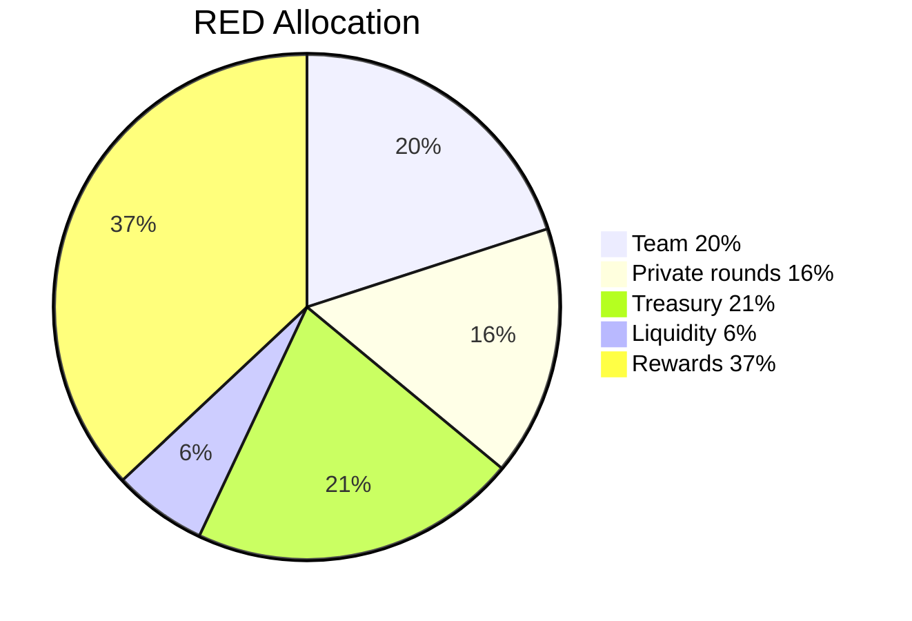

# RED Allocation

!!!warning Draft page
Draft page
!!!

1 billion RED will be minted and vested at genesis. The tokens will become available over the next 6 years.

- Team and future employees 20%, 3 years linear vesting
- Private rounds 16%, 3 years linear vesting
- Liquidity (protocol owned) 6%
- Treasury 21%
- Gov rewards 2%, 6 years
- Game rewards 33%, 6 years
- Community airdrops 2%, 6 years

