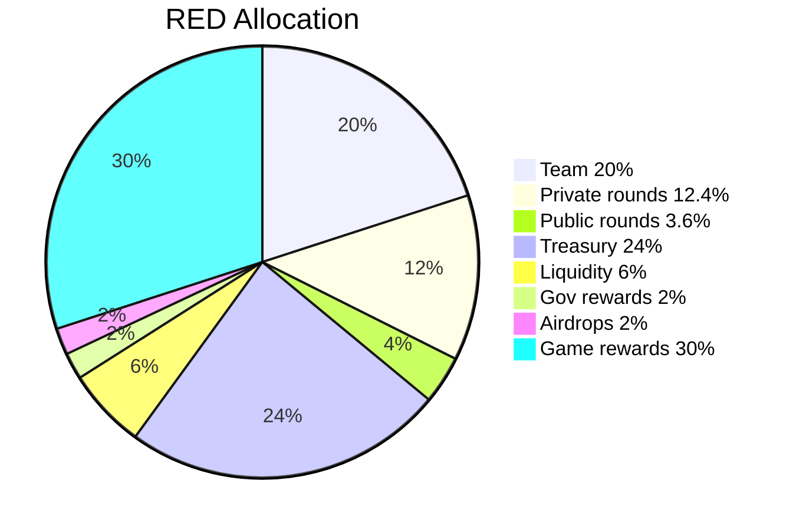

# RED Allocation

!!!warning Draft page
This page will evolve
!!!

100 million (100 000 000) RED will be minted and vested at genesis. The tokens will become available over the next 6 years.

- Team and future employees 20%, 3 years linear vesting
- Private rounds 12.4%, 3 years linear vesting
- Public rounds 3.6%, 3 years linear vesting
- Treasury 24%
- Liquidity (protocol owned) 6%
- Gov rewards 2%, 6 years
- Community airdrops 2%, 6 years
- Game rewards 30%, 6 years

