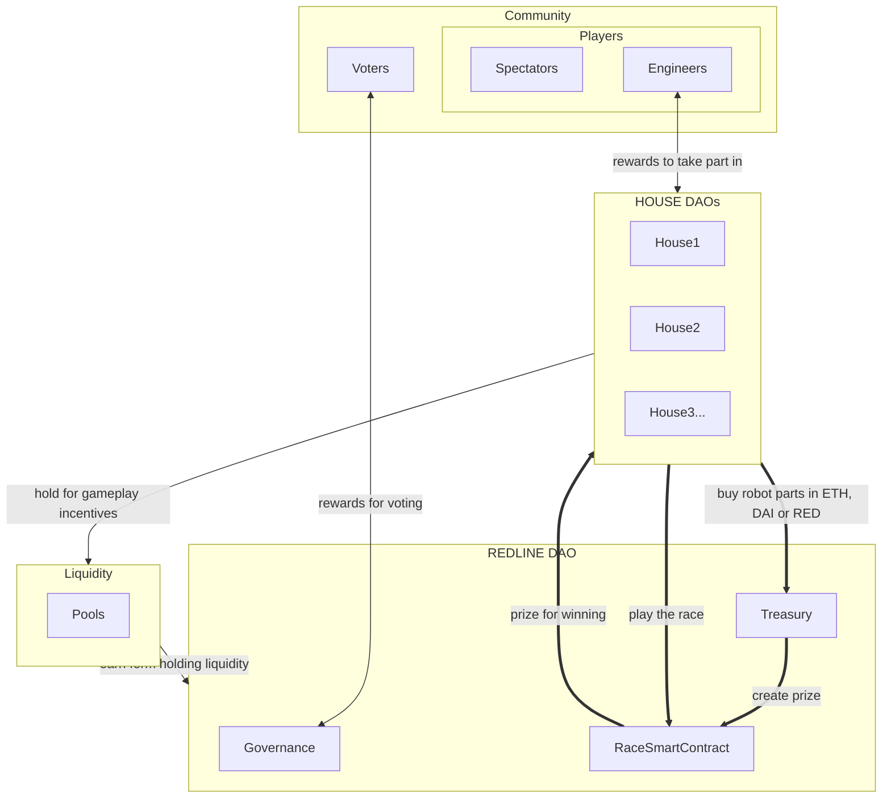

## Main game loop
The houses buy parts to build robots, they race in the ranked games, and win the prizes!

```mermaid
flowchart
subgraph dao[REDLINE DAO]
    Governance
    RaceSmartContract
    Treasury
    end
subgraph housedao [HOUSE DAOs]
    House1
    House2
    HouseDot[House3...]
    end
subgraph Community
    subgraph Players
        Spectators
        Engineers
        end
    Voters
    end
subgraph Liquidity
    Pools
    end

Liquidity -- earn form holding liquidity --> dao
housedao -- hold for gameplay incentives --> Liquidity
Engineers <-- rewards to take part in --> housedao
housedao == buy robot parts in ETH, DAI or RED ==> Treasury
housedao == play the race ==> RaceSmartContract
RaceSmartContract == prize for winning ==> housedao
Treasury == create prize ==> RaceSmartContract
Voters <-- rewards for voting --> Governance
```

