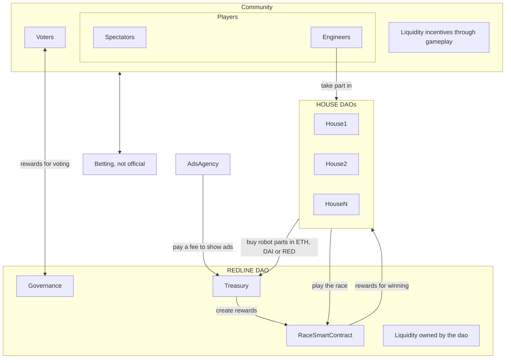

!!!warning Draft page
Draft page
!!!

```mermaid
flowchart
subgraph dao [REDLINE DAO]
    Governance
    RaceSmartContract
    Treasury
    Liquiditydao[Liquidity owned by the dao]
    end
subgraph housedao [HOUSE DAOs]
    House1
    House2
    HouseN
    end
subgraph Community
    Voters
    Liquidity[Liquidity incentives through gameplay]
    subgraph Players
        Spectators
        Engineers
        end
    end
Betting[Betting, not official]
AdsAgency

AdsAgency -- pay a fee to show ads --> Treasury
Engineers -- take part in --> housedao
housedao -- buy robot parts in ETH, DAI or RED --> Treasury
housedao -- play the race --> RaceSmartContract
RaceSmartContract -- rewards for winning --> housedao
Treasury -- create rewards --> RaceSmartContract
Community <--> Betting
Voters <-- rewards for voting --> Governance
```
Not shown on this graph are:
- secondary market fees
- non-gameplay NFT collectibles
---

## token utilities