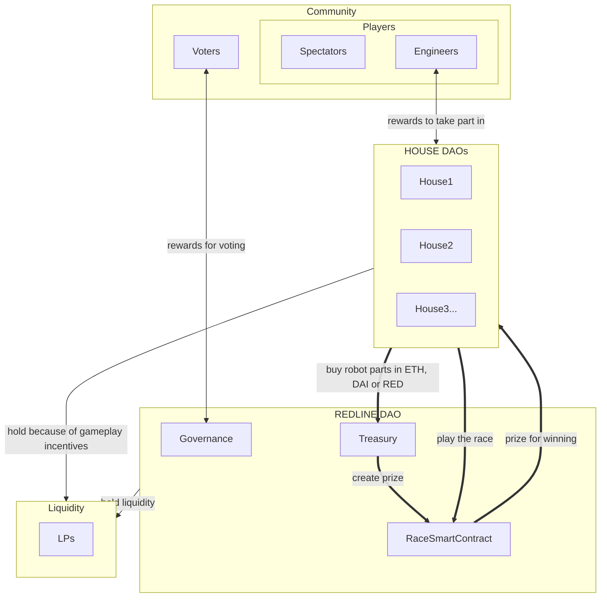

## Main game loop
The houses buy parts to build robots, they race in the ranked games, and win the prizes!

## Additional treasury streams:
### Robot parts customizations
While basic cosmetic customization of the robot is free, advanced looks for robot parts come for a fee.
### Auctions to display ads in-game
The races are fun to watch and ads will be an important part of the revenue. An auction system will determine which ads are shown on the Redline world, with the help of the Governance to moderate content. 
### Secondary market royalties
When parts are traded on secondary markets, Redline takes a royalty on the trade. The amount will be decided by the Governance.
### Sales of non-gameplay NFT collectibles
These are all the virtual goodies and merch that Redline and the Houses will offer to collect. Royalties also apply.
### Betting
Semi-independent betting smart contracts will be deployed, and a small fee might be router to the treasury, decided by Governance.

